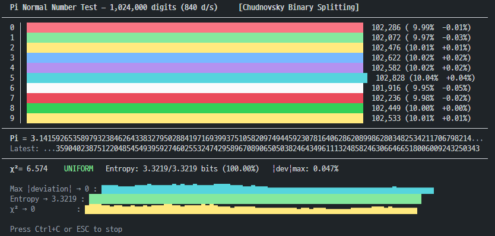

# Is Pi a Normal Number?

A terminal program that computes Pi digits in real time and visualizes the frequency distribution of each digit (0-9) to experimentally test whether Pi is a **Normal Number**.

> **Normal Number**: A number whose digits are uniformly distributed in every base. Whether Pi is a Normal Number remains an **open problem** in mathematics, but empirical evidence strongly supports it.



## Features

- **Chudnovsky Binary Splitting Algorithm** — the same algorithm used to set Pi world records
- **Real-time bar chart** — color-coded visualization of digit counts, percentages, and deviation from 10%
- **Statistical tests**
  - **Chi-squared (χ²)** — goodness-of-fit test for uniform distribution (df=9, α=0.05)
  - **Shannon Entropy** — convergence toward the theoretical maximum log₂(10) ≈ 3.3219 bits
  - **Max |deviation|** — largest deviation from the expected 10%
- **Convergence sparklines** — visual trace of how each metric converges to uniformity as more digits are computed
- **Flicker-free rendering** — in-place cursor overwrite with clear-to-EOL, no full-screen redraw

## Quick Start

```bash
# Build
cargo build --release

# Run
cargo run --release
```

Press `Ctrl+C` or `ESC` to stop.

## How It Works

### Algorithm

Implements the [Chudnovsky formula](https://en.wikipedia.org/wiki/Chudnovsky_algorithm) with Binary Splitting:

$$\frac{1}{\pi} = 12 \sum_{k=0}^{\infty} \frac{(-1)^k (6k)! (13591409 + 545140134k)}{(3k)!(k!)^3 \, 640320^{3k+3/2}}$$

- Each term yields ~14.18 decimal digits of precision
- Batch size grows progressively: 1,000 → 2,000 → 4,000 → ... → 2,000,000
- Computation runs on a background thread; the main thread handles visualization

### Statistical Tests

| Metric | Threshold | Interpretation |
|---|---|---|
| χ² < 16.919 | df=9, p=0.05 | Cannot reject uniform distribution → **UNIFORM** |
| Entropy → 3.3219 | log₂(10) bits | Digit probabilities are equal |
| \|dev\|max → 0 | Deviation from 10% | All digits converge to exactly 10% |

## Results (1,024,000 digits)

```
χ² = 6.574    UNIFORM
Entropy: 3.3219/3.3219 bits (100.00%)
|dev|max: 0.047%
```

At one million digits, each digit 0-9 appears at almost exactly 10%, passing all uniformity tests.

## Dependencies

- [`num-bigint`](https://crates.io/crates/num-bigint) — Arbitrary-precision integer arithmetic
- [`num-traits`](https://crates.io/crates/num-traits) — Numeric traits
- [`crossterm`](https://crates.io/crates/crossterm) — Cross-platform terminal manipulation

## License

MIT
